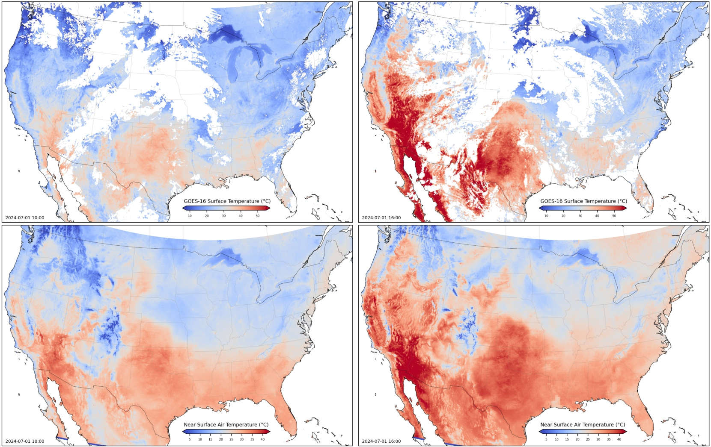

# HourlyAirTemp2kmUSA
HourlyAirTemp2kmUSA

Uncertainty-Aware Hourly Air Temperature Mapping at 2 km Resolution via Physics-Guided Deep Learning

Shengjie Liu et al. 

## Dataset
Near-surface air temperature, 2 km resolution, over the Contiguous United States, 2018-2024

Download dataset via: [https://doi.org/10.5281/zenodo.15252812](https://doi.org/10.5281/zenodo.15252812)

Use the visual.py script to open the data: [github.com/skrisliu/HourlyAirTemp2kmUSA](https://github.com/skrisliu/HourlyAirTemp2kmUSA)

## Preview

## Comparison

Upper row: surface temperature data observations, incomplete

Lower row: estimated near-surface air temperature

