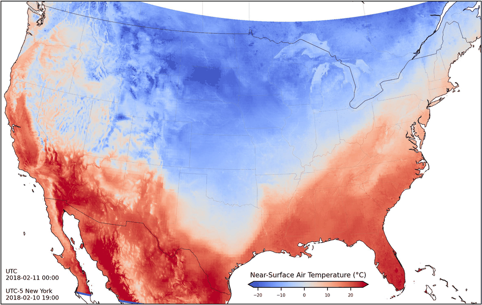
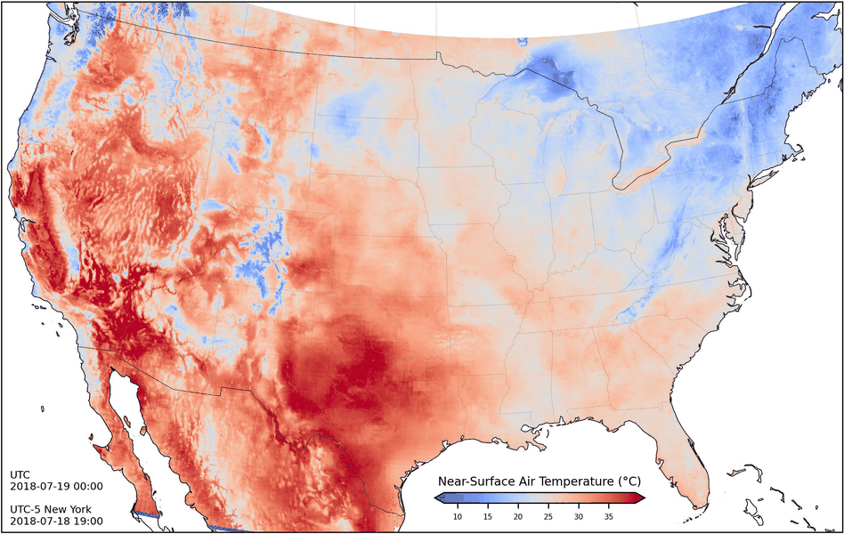

# Hourly Air Temperature Mapping at 2 km Resolution in the United States (2018-2024) Using Physics-Guided Deep Learning

**Author:** Shengjie Kris Liu  
**Email:** [skrisliu@gmail.com](mailto:skrisliu@gmail.com)

- **GitHub Repository:** [HourlyAirTemp2kmUSA](https://github.com/skrisliu/HourlyAirTemp2kmUSA)
- **Download Dataset:** [Dataset at Zenodo](https://doi.org/10.5281/zenodo.15252812)
- **Visualization Code:** [Code to read and visualize data](https://github.com/skrisliu/HourlyAirTemp2kmUSA/blob/main/visual.py)

This repository provides the near-surface air temperature dataset across the Contiguous United States (2018-2024) at 2 km resolution, generated using physics-guided deep learning with uncertainty quantification.


## Dataset Description

- Hourly air temperature at 2 km resolution for CONUS, 2018-2024.
- Data range: 0-65535 (65535 = no data).
- Conversion: Kelvin = value * 0.00341802 + 149; Celsius = Kelvin - 273.15; Fahrenheit = Celsius * 9/5 + 32.
- Mean predictions available at [Zenodo](https://doi.org/10.5281/zenodo.15252812).
- Uncertainty data sample (2018, ~35GB) at [OSF](https://osf.io/2x7nt/files/osfstorage). Contact author for full uncertainty dataset.

## Visualization

Use [visual.py](https://github.com/skrisliu/HourlyAirTemp2kmUSA/blob/main/visual.py) to render hourly temperature data with animations.

## Previews

### February 11, 2018


### July 19, 2018



## Want to Know More?

Liu, Shengjie Kris, Siqin Wang, and Lu Zhang. "Uncertainty-Aware Hourly Air Temperature Mapping at 2 km Resolution via Physics-Guided Deep Learning." arXiv preprint [arXiv:2509.12329](https://arxiv.org/abs/2509.12329) (2025).

```bibtex
@article{liu2025uncertainty,
  title={Uncertainty-Aware Hourly Air Temperature Mapping at 2 km Resolution via Physics-Guided Deep Learning},
  author={Liu, Shengjie Kris and Wang, Siqin and Zhang, Lu},
  journal={arXiv preprint arXiv:2509.12329},
  year={2025}
}
```

---

© 2025 Shengjie Kris Liu. Licensed under [CC BY 4.0](https://creativecommons.org/licenses/by/4.0/).